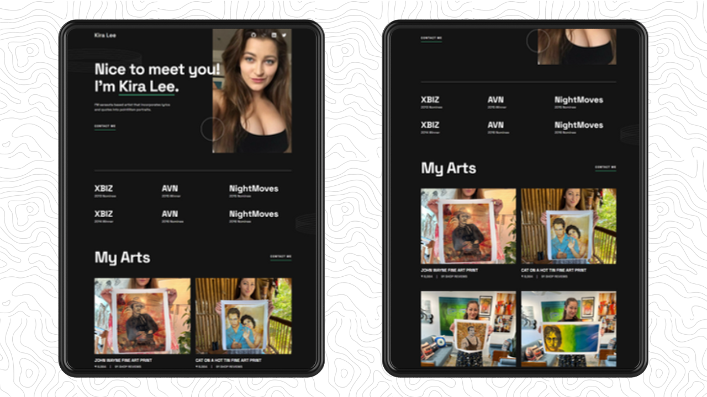
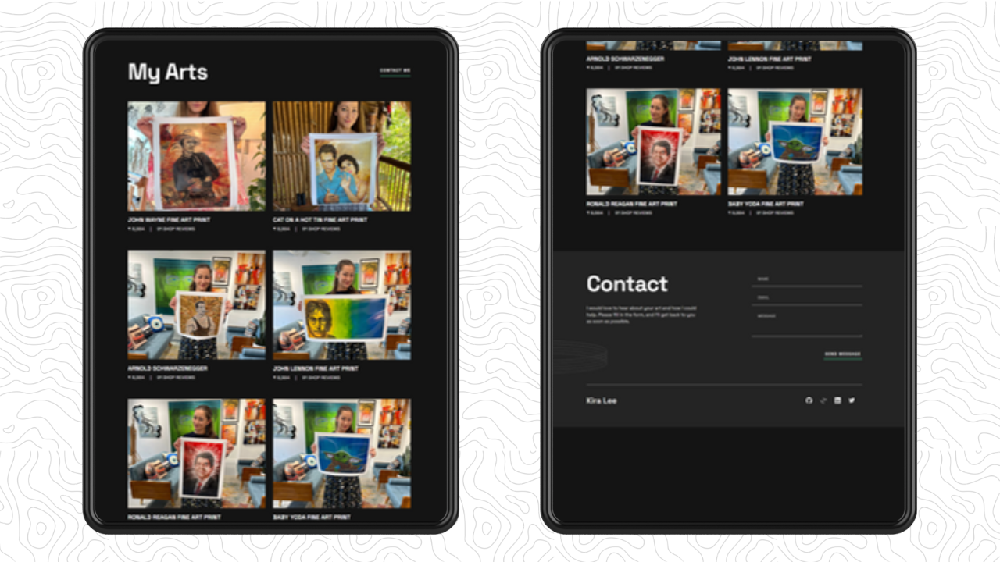
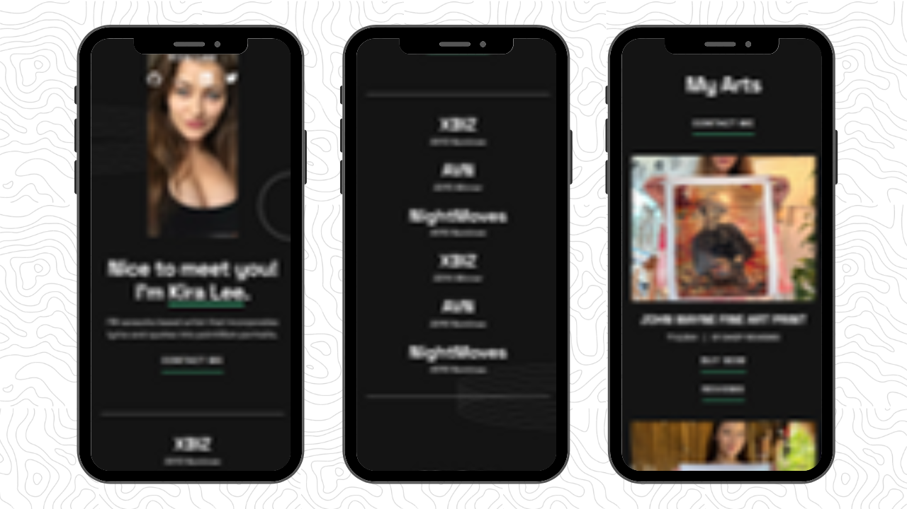
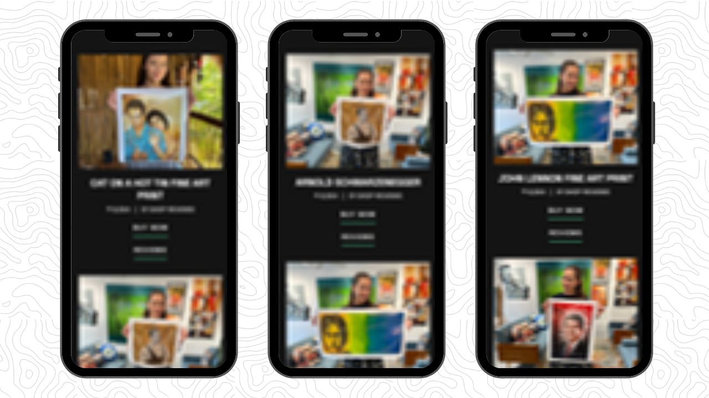
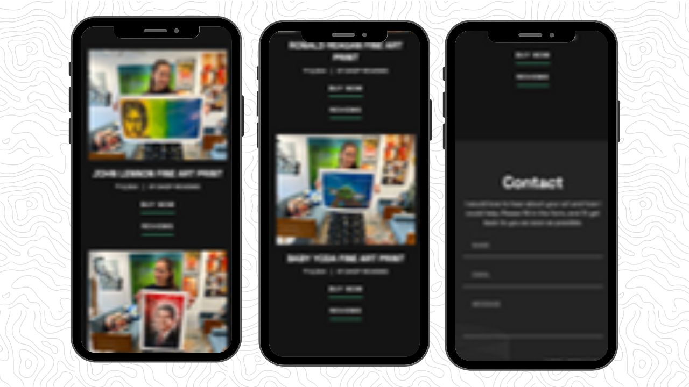

<div align="center">
  


[](https://twitter.com/intent/follow?screen_name=withaarzoo)
[](https://youtu.be/SXShIpZyf8w)

  <br />
  <br />

  <h2 align="center">Kira Lee's Portfolio Website</h2>

  Welcome to Kira Lee's Portfolio Website project! This repository contains the HTML and CSS code for creating a professional and responsive portfolio website to showcase Kira's work and achievements.

  <div>
    <a href="https://youtu.be/SXShIpZyf8w"><strong>➥ Watch Tutorial</strong></a>
    <br>
    <br>
    <a href="tel:+917586073575"><strong>➥ Download Full Source Code</strong></a>
  </div>

</div>

## Getting Started

To get started with Kira Lee's Portfolio Website, follow these steps:

1. Clone the repository to your local machine:

```bash
git clone https://github.com/withaarzoo/Portfolio-Website--Kira-Lee.git
```

2. Open the project in your favorite code editor.

3. Explore the files and start customizing the content to fit Kira's portfolio needs.

## Essential Links

- Google Fonts: [click here](https://fonts.google.com/)
- Icons8: [click here](https://icons8.com/)

## Source Code

You can find the complete source code for the Portfolio Project on WhatsApp:

- +917586073575 ( WhatsApp )

## Video Tutorial

Need some extra guidance? Watch our video tutorial on setting up and customizing your portfolio:

- [Kira Lee's Portfolio Project Tutorial](https://youtu.be/SXShIpZyf8w)

## Connect with Me

If you want to contact me you can reach me at [Twitter](https://twitter.com/withaarzoo).

## Demo Screenshots







---

**Happy Coding!** 🚀
